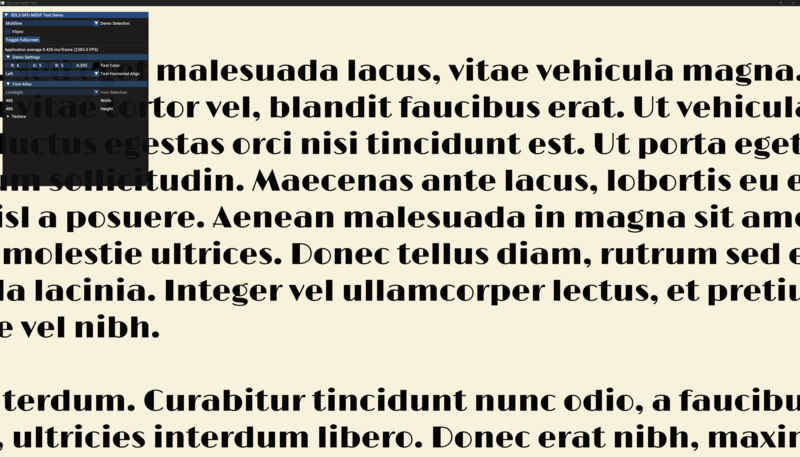
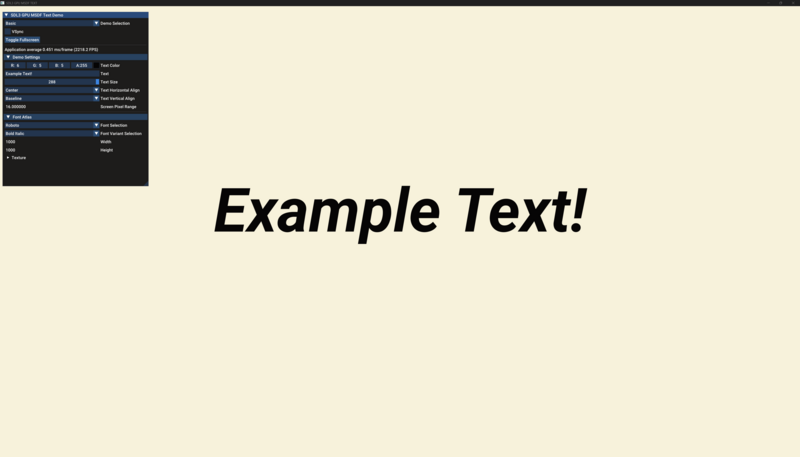
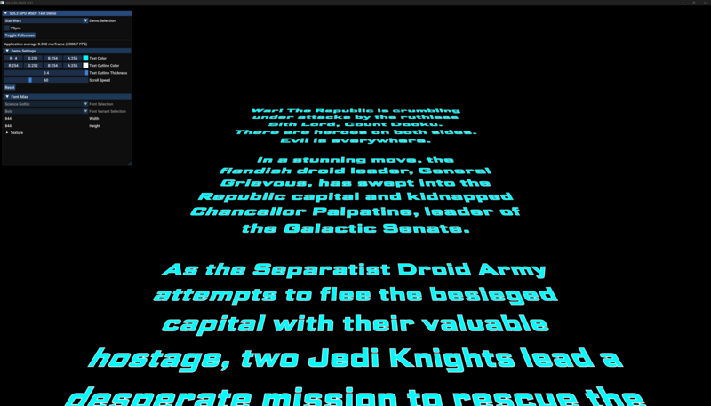

# SDL3 GPU MSDF TEXT EXAMPLE

This repository contains example code for efficiently drawing text using multichannel signed distance field (MSDF) texture atlases using SDL3 and the GPU API.

The texture atlases are generated at build time using Chlumsky's [msdf-atlas-gen](https://github.com/Chlumsky/msdf-atlas-gen).

<p>
  
  
  
</p>

[Demo Video](https://anthonydelciotto.com/media/sdl3_gpu_msdf_text.mp4)

## Build

### Windows

Building the code can be done in a terminal which is equipped with the ability to call MSVC command line.

This is generally done by calling `vcvarsall.bat x64`, which is included in the Microsoft C/C++ Build Tools. This script is automatically called by the `x64 Native Tools Command Prompt for VS <year>` variant of the vanilla `cmd.exe`. If you've installed the build tools, this command prompt may be easily located by searching for `Native` from the Windows Start Menu search. The same script is also called automatically in the `Developer Command Prompt for VS <year>` profile of the terminal app.

You can ensure that the MSVC compiler is accessible from your command line by running:

```
cl
```

If everything is set up correctly, you should have output very similar to the following:

```
Microsoft (R) C/C++ Optimizing Compiler Version 19.44.35216 for x64
Copyright (C) Microsoft Corporation.  All rights reserved.

usage: cl [ option... ] filename... [ /link linkoption... ]
```

Now just run `build.bat` script.


```
build release
```


You should see the following output:

```
[release mode]
Loaded geometry of 95 out of 95 glyphs from font "..\fonts\Roboto-Regular.ttf".
Loaded geometry of 95 out of 95 glyphs from font "..\fonts\Roboto-Bold.ttf".
Loaded geometry of 95 out of 95 glyphs from font "..\fonts\Roboto-Italic.ttf".
Loaded geometry of 95 out of 95 glyphs from font "..\fonts\Roboto-BoldItalic.ttf".
Loaded geometry of 95 out of 95 glyphs from font "..\fonts\Roboto-Light.ttf".
Atlas dimensions: 1000 x 1000
Atlas image file saved.
Glyph layout and metadata written into JSON file.
Loaded geometry of 95 out of 95 glyphs from font "..\fonts\ScienceGothic-Regular.ttf".
Loaded geometry of 95 out of 95 glyphs from font "..\fonts\ScienceGothic-Bold.ttf".
Loaded geometry of 95 out of 95 glyphs from font "..\fonts\ScienceGothic-Light.ttf".
Atlas dimensions: 844 x 844
Atlas image file saved.
Glyph layout and metadata written into JSON file.
Loaded geometry of 95 out of 95 glyphs.
Atlas dimensions: 480 x 480
Atlas image file saved.
Glyph layout and metadata written into JSON file.
sdl3_gpu_msdf_text.cpp
imgui.cpp
imgui_demo.cpp
imgui_draw.cpp
imgui_impl_sdl3.cpp
imgui_impl_sdlgpu3.cpp
imgui_tables.cpp
imgui_widgets.cpp
Generating Code...
```


If everything worked correctly, there will be a `build` folder in the root level of the project, and it will contain a freshly-built `sdl3_gpu_msdf_text.exe`.

This `sdl3_gpu_msdf_text.exe` has been built in release mode. If you'd like to modify the source and debug it, you can just run `build.bat` with no arguments for a debug build. Furthermore, you can run `build.bat` with the argument `skipfonts` to prevent re-generating the fonts every build.


### Linux

TODO

## TODO

- [ ] Add Text_Static abstraction and example for drawing lots of static pre-uploaded text (millions of glyphs).
- [ ] Add blur effect and use mtsdf atlases.
- [ ] Upload pre-built windows exe to releases.
- [ ] Build scripts and testing on Linux.

## References

* https://github.com/Chlumsky/msdfgen
* https://moonside.games/posts/sdl-gpu-sprite-batcher/
* https://github.com/TheSpydog/SDL_gpu_examples

## Dependencies / Tools

* [HandmadeMath](https://github.com/HandmadeMath/HandmadeMath)
* [SDL3](https://wiki.libsdl.org/SDL3/FrontPage)
* [ImGui](https://github.com/ocornut/imgui)
* [JSON for Modern C++](https://github.com/nlohmann/json)
* [stb_image](https://github.com/nothings/stb)
* [msdf-atlas-gen](https://github.com/Chlumsky/msdf-atlas-gen) for generating font atlases at build time.
* [SDL_shadercross](https://github.com/libsdl-org/SDL_shadercross) for compiling shaders at build time.
